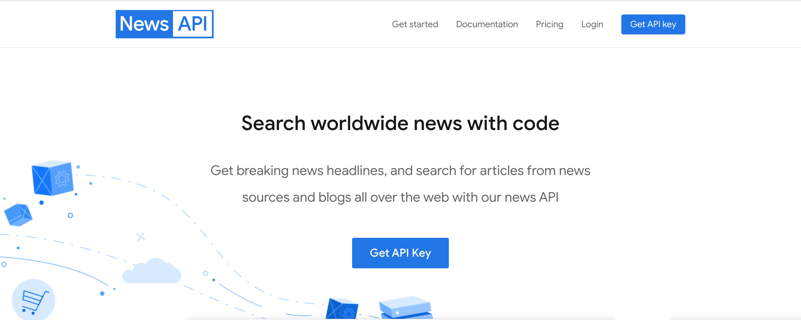

# Node and Android based Stock application (Google Cloud)

A native android mobile app developed as part of CSCI 571 - Web Technologies @ USC. This repository only contains the source code for Node javascript backend. The Android frontend is present here: https://github.com/adityachandupatla/android-stock-frontend

<h2>Project Goals</h2>
<ul>
  <li>Become familiar with asynchronous event-driven programming model of <a href="https://nodejs.dev/learn">Node</a></li>
  <li>Extensively use <a href="https://www.npmjs.com/">NPM</a> - Node package manager</li>
  <li>Use latest <a href="https://en.wikipedia.org/wiki/ECMAScript">ECMAScript</a> features such as 'let', 'const', etc</li>
  <li><a href="https://expressjs.com/">ExpressJS</a> for quickly setting up routes</li>
  <li>Host/Deploy the entire site to <a href="https://cloud.google.com/appengine">Google App Engine</a></li>
</ul>

<h2>Consume REST API's</h2>
<a href="https://api.tiingo.com/">Tiingo API</a>  
 
<a href="https://newsapi.org/">News API</a>  
 

<h2>API response</h2>
The Node backend also exposes data in the form of a REST API, which can be consumed by any other application (not just the Android frontend) 

